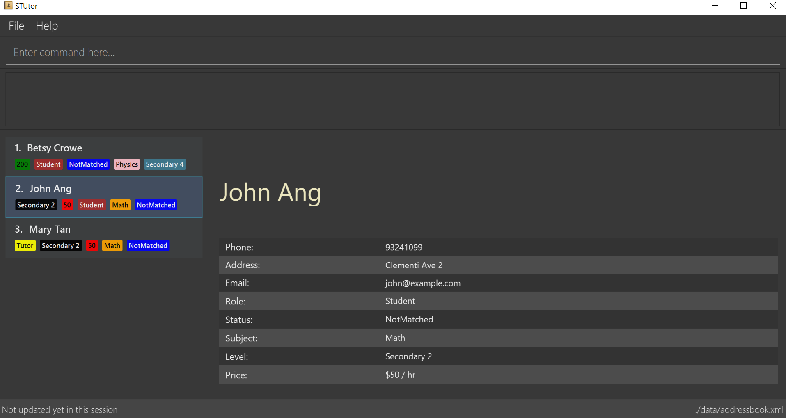

= STUtor
ifdef::env-github,env-browser[:relfileprefix: docs/]

https://travis-ci.org/CS2103JAN2018-W11-B1/main[image:https://travis-ci.org/CS2103JAN2018-W11-B1/main.svg?branch=master[Build Status]]
https://ci.appveyor.com/project/alexawangzi/main/branch/master[image:https://ci.appveyor.com/api/projects/status/uawhtnq68lp8dg2e/branch/master?svg=true[Build status]]
https://coveralls.io/github/CS2103JAN2018-W11-B1/main?branch=master[image:https://coveralls.io/repos/github/CS2103JAN2018-W11-B1/main/badge.svg?branch=master[Coverage Status]]
https://www.codacy.com/app/damith/addressbook-level4?utm_source=github.com&utm_medium=referral&utm_content=se-edu/addressbook-level4&utm_campaign=Badge_Grade[image:https://api.codacy.com/project/badge/Grade/fc0b7775cf7f4fdeaf08776f3d8e364a[Codacy Badge]]
https://gitter.im/se-edu/Lobby[image:https://badges.gitter.im/se-edu/Lobby.svg[Gitter chat]]

== UI

ifdef::env-github[]

endif::[]

ifndef::env-github[]
image::images/Ui.png[width="600"]
endif::[]

* This is a desktop Address Book application, specialised for people who need to coordinate tutors with students.
* Whether working for a tuition company, or as a freelance, this will help you keep track of everything going on with your students and tutors.

== Site Map

* <<UserGuide#, User Guide>>
* <<DeveloperGuide#, Developer Guide>>
* <<AboutUs#, About Us>>
* <<ContactUs#, Contact Us>>

== Acknowledgements

* Original source for the code in this project is the Addressbook-level4 created by the SE-EDU initiative at https://github.com/se-edu/
* Some parts of this sample application were inspired by the excellent http://code.makery.ch/library/javafx-8-tutorial/[Java FX tutorial] by
_Marco Jakob_.
* Libraries used: https://github.com/TomasMikula/EasyBind[EasyBind], https://github.com/TestFX/TestFX[TextFX], https://bitbucket.org/controlsfx/controlsfx/[ControlsFX], https://github.com/FasterXML/jackson[Jackson], https://github.com/google/guava[Guava], https://github.com/junit-team/junit4[JUnit4]

== Licence : link:LICENSE[MIT]
